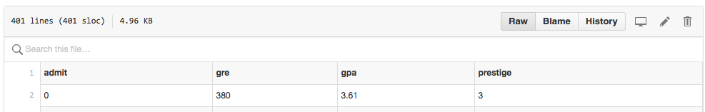
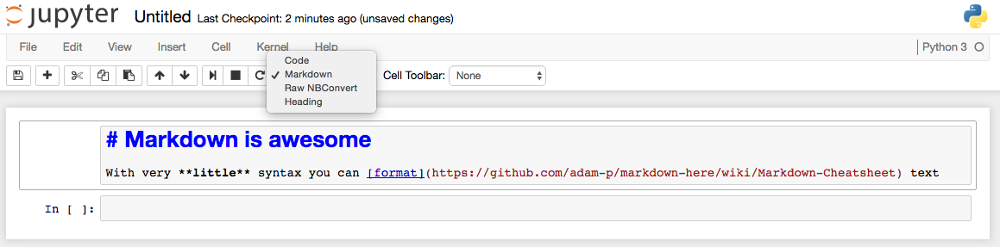
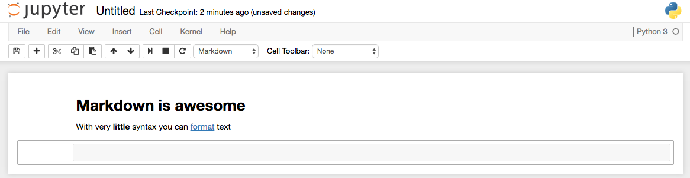

#  Project #1: Research Design Write-Up
DS | Unit Project 1

### PROMPT

In this first project you will create a framework to scope out data science projects. This framework will provide you with a guide to develop a well-articulated problem statement and analysis plan that will be robust and reproducible.

**Goals:**

* Create a structured iPython notebook using markdown
* Load and start exploring the data

---

### DELIVERABLES

#### Completed iPython Notebook

- **Requirements:**
    - Identify features of the dataset, including the outcome and covariates/predictors
    - Create a data dictionary with classification of available variables
    - Write a high quality problem statement
    - Analyze the data

- **Bonus:**
    - Insightful graphic or statistical exploration

- **Submission**:
    * Please push the notebook to your github repo and post the link on the slack classwork channel

---

### TIMELINE

| Deadline | Deliverable| Description |
|:-:|---|---|
| Lesson 3 | Project 1  | Research Design Write-Up   |

---

### EVALUATION

Your project will be assessed according to:

    Score | Expectations
    ----- | ------------
    **0** | _Incomplete._
    **1** | _Does not meet expectations._
    **2** | _Meets expectations, good job!_
    **3** | _Exceeds expectations, you wonderful creature, you!_

While your total score is a helpful gauge of whether you've met overall project goals, __specific scores are more important__ since they'll show you where to focus your efforts in the future!

---

### RESOURCES

#### Dataset

We'll be using a classic dataset from UCLA's Logistic Regression in R [tutorial](http://www.ats.ucla.edu/stat/r/dae/logit.htm). Our goal will be to identify the various factors that may influence admission into graduate school. The dataset contains four variables- admit, gre, gpa, rank.

- 'admit' is a binary variable. It indicates whether or not a candidate was admitted (admit =1) our not (admit= 0)
- 'gre' is GRE score
- 'gpa' stands for Grade Point Average
- 'rank' is the rank of an applicant's undergraduate alma mater, with 1 being the highest and 4 as the lowest

> Dataset: [admissions.csv](./admissions.csv)

(Note: clicking on the "Raw" button/ tab gives you the raw csv data that you can copy/paste into a local file)

The same dataset is the subject of this excellent blog post on [logistic regression](http://blog.yhat.com/posts/logistic-regression-and-python.html) on the yhat's site.

#### Jupyter Notebook and Markdown

For this project we will be using an iPython notebook and use [markdown](https://en.wikipedia.org/wiki/Markdown) syntax to add text and structure to the notebook.

Markdown is a great way to publish text with the minimum syntax and formating. This current page is all written in markdown and so are all the slides from the course. See this [markdown cheatsheet](https://github.com/adam-p/markdown-here/wiki/Markdown-Cheatsheet).

1. Select mardown from the drop down

2. Write your own markdown formatted text
3. See the results

See also [Jupyter Keyboard Shorcuts](https://sowingseasons.com/blog/reference/2016/01/jupyter-keyboard-shortcuts/23298516) to specify the nature of a notebook cell.

The [Jupyter documentation](http://jupyter-notebook.readthedocs.io/en/latest/examples/Notebook/What%20is%20the%20Jupyter%20Notebook.html) is excellent. Never hesitate to look it up.

---